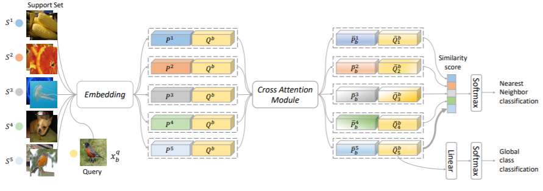

# fewshot-CAN
This repository contains the code for the paper:
<br>
[**Cross Attention Network for Few-shot Classification**](https://arxiv.org/pdf/1910.07677.pdf)
<br>
Ruibing Hou, Hong Chang, Bingpeng Ma, Shiguang Shan, Xilin Chen
<br>
NeurIPS 2019 
<p align='center'>
  
</p>

### Abstract

Few-shot classification aims to recognize unlabeled samples from unseen classes given only few labeled samples. The unseen classes and low-data problem make few-shot classification very challenging. Many existing approaches extracted features from labeled and unlabeled samples independently, as a result, the features are not discriminative enough. In this work, we propose a novel Cross Attention
Network to address the challenging problems in few-shot classification. Firstly, Cross Attention Module is introduced to deal with the problem of unseen classes. The module generates cross attention maps for each pair of class feature and query sample feature so as to highlight the target object regions, making the extracted feature more discriminative. Secondly, a transductive inference algorithm is proposed to alleviate the low-data problem, which iteratively utilizes the unlabeled query set to augment the support set, thereby making the class features more representative. Extensive experiments on two benchmarks show our method is a simple, effective and computationally efficient framework and outperforms the state-of-the-arts.

### Citation

If you use this code for your research, please cite our paper:
```
@inproceedings{CAN,
  title={Cross Attention Network for Few-shot Classification},
  author={Ruibing Hou and Hong Chang and Bingpeng Ma and Shiguang Shan and Xilin Chen},
  booktitle={NeurIPS},
  year={2019}
}
```

### Trained models:
We have released our trained models of CAN on miniImageNet and tieredImageNet benchmark at [google drive](https://drive.google.com/drive/folders/1Gi3GvQB3Ypwu-QW_CVmToLC64fMv8TqO?usp=sharing).

### Platform
This code was developed and tested with pytorch version 1.0.1

## Acknowledgments

This code is based on the implementations of [**Dynamic Few-Shot Visual Learning without Forgetting**](https://github.com/gidariss/FewShotWithoutForgetting).
